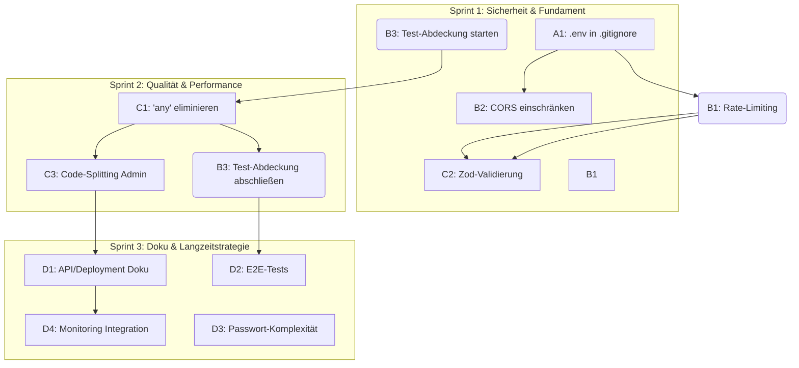

docs\AKTIONEN-PLAN.md# Aktionsplan: IONIO Culinary Canvas - Risikobehebung und Qualitätssteigerung

**Erstellungsdatum:** 1. Februar 2026
**Basierend auf:** [docs/PROJEKTBERICHT.md:1]
**Ziel:** Bereitstellung eines ausführbaren Arbeitsdokuments zur Behebung identifizierter Schwachstellen.

---

## 1. Priorisierte Fehlerliste und Risikoanalyse

Die Probleme sind nach Kritikalität kategorisiert, wobei die kritischste Sicherheitslücke (A1) die höchste absolute Priorität hat. Die Komplexität ersetzt die zeitbasierte Aufwandsschätzung, um die Entwicklungsanforderung (keine Zeitschätzungen) zu erfüllen.

| ID | Kategorie | Kritikalität | Problembeschreibung | Begründung (Risiko) | Komplexität |
|----|-----------|--------------|---------------------|---------------------|-------------|
| **A1** | Sicherheit | Kritisch | Die Datei [`.env`](.env) ist nicht in [`.gitignore`](.gitignore) erfasst. | **Credentials-Leak-Risiko:** Geheimnisse (Supabase Keys etc.) könnten unbeabsichtigt in das Repository gepusht werden. **Sofortige Behebung erforderlich.** | Niedrig |
| **B1** | Sicherheit | Hoch | Fehlendes Rate-Limiting für den Login-Endpunkt ([src/pages/AdminLogin.tsx:1]). | **Brute-Force-Risiko:** Der Admin-Login kann ohne Verzögerung beliebig oft attackiert werden. | Mittel |
| **B2** | Sicherheit | Hoch | Edge Function verwendet CORS-Wildcard (*) in der Konfiguration. | **Unbefugter Zugriff:** Ermöglicht beliebigen Domains das Aufrufen der Serverless-Funktion. | Niedrig |
| **B3** | Qualität | Hoch | Unvollständige Testabdeckung, insbesondere für kritische Admin-Komponenten und Hooks. | **Hohes Regressionsrisiko:** Erschwert Refactoring und macht zukünftige Code-Änderungen instabil. | Hoch |
| **C1** | Qualität | Mittel | Vorhandensein von TypeScript `any` Types. | **Technische Schuld:** Reduziert Typsicherheit, erhöht Wartungsaufwand. | Mittel |
| **C2** | Sicherheit | Mittel | Fehlende Zod-Schema-Validierung auf API-Ebene für kritische Formulare. | **Input-Injection-Risiko:** Unzureichende Validierung der Datenstruktur vor Verarbeitung/Speicherung. | Mittel |
| **C3** | Performance | Mittel | Kein Code-Splitting für den Admin-Bereich. | **Performance-Einbuße:** Größeres initiales Bundle für alle Nutzer (LCP-Verschlechterung). | Mittel |
| **D1** | Doku | Mittel | Fehlende API- und Deployment-Dokumentation. | **Wartbarkeit:** Erschwert Onboarding und den zuverlässigen Deployment-Prozess. | Mittel |
| **D2** | Tests | Niedrig | Fehlende E2E-Tests zur Abbildung kritischer Nutzer-Flows (z.B. Admin-Login, Menü-Änderung). | **Langfristige Qualität:** Keine automatisierte End-to-End-Validierung des Gesamtsystems. | Hoch |
| **D3** | Sicherheit | Niedrig | 8-Zeichen Passwort-Minimum (zu niedrig). | **Verbesserung der Sicherheits-Baseline:** Erhöhung des Mindestmaßes empfohlen. | Niedrig |
| **D4** | Betrieb | Niedrig | Keine Monitoring-Integration (Error-Tracking, Performance-Monitoring). | **Betriebsrisiko:** Fehler in der Produktion bleiben unentdeckt. | Mittel |

---

## 2. Konkrete Lösungsschritte

| ID | Aufgabe | Technische Anweisungen |
|----|---------|------------------------|
| A1 | Kritische Sicherheitslücke schließen | 1. Füge in [`.gitignore`](.gitignore) die Zeile `.env` hinzu. 2. Überprüfe, ob [`.env`](.env) versehentlich gepusht wurde; wenn ja, rotiere alle in [`.env`](.env) enthaltenen Secrets (Supabase-Schlüssel, etc.). 3. Entferne [`.env`](.env) aus dem Git-Verlauf: `git rm --cached .env`. |
| B1 | Rate-Limiting für Login | Implementiere Serverseitiges Rate-Limiting auf dem Supabase Auth Endpunkt oder der [supabase/functions/verify-admin/index.ts] Edge Function (z.B. mittels `Deno.Kv` oder Redis). |
| B2 | CORS-Origins einschränken | In der Konfiguration der Supabase Edge Functions (speziell [supabase/functions/verify-admin/index.ts]) die `CORS` Header von `*` auf die exakte Produktions-Frontend-URL beschränken. |
| B3 | Test-Abdeckung erhöhen | Füge Unit-Tests für alle `use...` Hooks und Integration-Tests für alle Admin-Seiten unter [src/pages/admin/](src/pages/admin/) hinzu. Ziel: ≥ 70% Code-Coverage. |
| C1 | TypeScript `any` eliminieren | Iteriere alle Dateien, identifiziere und ersetze alle Vorkommen von `any` durch präzise Typen (z.B. aus [src/integrations/supabase/types.ts:1]). |
| C2 | Zod-Validierung implementieren | Füge eine `z.object` Schema-Validierung zu `React Hook Form` in kritischen Formularen hinzu. Nutze `z.safeParse()` um die Daten vor dem Senden an Supabase zu validieren. |
| C3 | Code-Splitting Admin | Implementiere Lazy Loading für den Admin-Bereich (z.B. [src/App.tsx:1] und [src/pages/AdminLogin.tsx:1] sowie alle Unterseiten) mit `React.lazy` und `Suspense`. |
| D1 | Deployment- & API-Doku | Erstelle eine [docs/DEPLOYMENT-GUIDE.md] mit Schritt-für-Schritt-Anweisungen und eine [docs/API-DOKU.md] für Supabase Schemas und Edge Functions. |
| D2 | E2E-Tests einführen | Implementiere Playwright/Cypress-Setup im Projekt und schreibe erste E2E-Tests für den Login-Flow und das Speichern/Löschen von Menüpunkten. |
| D3 | Passwort-Komplexität erhöhen | Ändere die Supabase-Konfiguration (oder die Anmelde-UI/Validierung) auf ein Passwort-Minimum von 12 Zeichen. |
| D4 | Monitoring-Integration | Integriere einen Error-Tracking-Service (z.B. Sentry, Datadog) zur Überwachung der Produktion. |

---

## 3. Umsetzungsreihenfolge und Abhängigkeiten

### Abhängigkeitsmatrix (Mermaid Diagramm)

### Empfohlene Implementierungsreihenfolge (Sprint-Plan)

| Sprint | ID | Aufgabe | Priorität |
|--------|----|---------|-----------|
| **1** | A1 | Kritische Sicherheitslücke schließen (`.env` in [`.gitignore`](.gitignore)) | Kritisch |
| **1** | B2 | CORS-Origins einschränken (Edge Function) | Hoch |
| **1** | B1 | Rate-Limiting für Login implementieren | Hoch |
| **1** | B3 | Test-Abdeckung erhöhen (Unit-Tests für Hooks/Admin) – Start | Hoch |
| **1** | C2 | Zod-Validierung implementieren (Input-Sicherheit) – Start | Mittel |
| **2** | C1 | TypeScript `any` eliminieren (Refactoring) | Mittel |
| **2** | C3 | Code-Splitting für Admin-Bereich implementieren | Mittel |
| **2** | B3 | Test-Abdeckung erhöhen – Abschluss (Ziel-Coverage erreichen) | Hoch |
| **2** | C2 | Zod-Validierung – Abschluss | Mittel |
| **3** | D1 | Deployment-Guide und API-Dokumentation erstellen | Mittel |
| **3** | D4 | Monitoring-Integration (Error Tracking) | Niedrig |
| **3** | D3 | Passwort-Komplexität erhöhen (12 Zeichen) | Niedrig |
| **3** | D2 | E2E-Tests einführen | Niedrig |

---

## 4. Testkriterien, Validierung und Verantwortlichkeiten

### Testkriterien und Validierung

| ID | Akzeptanzkriterien (Definition of Done) | Validierungsmethode |
|----|------------------------------------------|----------------------|
| A1 | [`.env`](.env) ist in [`.gitignore`](.gitignore) eingetragen. Secrets wurden rotiert und nicht mehr im Git-Verlauf. | Manuelle Überprüfung des [`.gitignore`](.gitignore) und des Git-Verlaufs. |
| B1 | Eine Rate-Limit-Überschreitung führt zu einem 429-Fehler nach X Versuchen in Y Sekunden. | Penetration-Test (Brute-Force-Simulation) gegen den Login-Endpunkt. |
| B2 | Der Zugriff auf die Edge Function ist nur von der Produktions-URL des Frontends möglich. | Test-API-Aufruf von einer nicht-autorisierten Domain (muss fehlschlagen). |
| B3 | Die Code-Coverage liegt bei oder über 70% (Hooks und Admin-Seiten sind abgedeckt). | Ausführung des `vitest run --coverage` Befehls. |
| C1 | Es existiert kein Vorkommen des `any` Types mehr im Anwendungs- oder Integrationscode. | Code-Review/grep-Suche nach `:\sany`. |
| C2 | Alle kritischen Formularfelder sind mit `z.object` definiert und die Validierung greift, bevor Daten an Supabase gesendet werden. | Negative Testfälle (ungültige Input-Daten) im Formular-Test. |
| C3 | Der initial geladene JS-Bundle-Size für die öffentliche Seite reduziert sich um mindestens 10%. | Lighthouse-Audit oder Build-Analyse (`vite build --json`). |
| D1 | [docs/DEPLOYMENT-GUIDE.md] und [docs/API-DOKU.md] sind erstellt und aktuell. | Dokumentations-Review durch ein Nicht-Entwicklungsmitglied. |
| D2 | E2E-Test-Framework ist eingerichtet und der Login-Flow ist automatisiert. | Ausführung von Playwright/Cypress-Tests (muss erfolgreich durchlaufen). |
| D3 | Der Admin-Login erzwingt ein Passwort von mindestens 12 Zeichen. | Testversuch mit 8- und 12-stelligen Passwörtern. |
| D4 | Produktionsfehler (z.B. durch manuelle Fehlerinjektion) werden im Monitoring-Dashboard protokolliert. | Manuelle Auslösung eines `throw new Error()` in [src/App.tsx:1] und Prüfung des Dashboards. |

### Verantwortlichkeiten (Skill-Set-Matrix)

| ID | Aufgabe | Primäre Verantwortung | Sekundäre Unterstützung |
|----|---------|------------------------|--------------------------|
| A1 | Gitignore / Secrets Rotation | DevOps / Backend | Lead-Developer |
| B1 | Rate-Limiting (Edge Function) | Backend / Supabase-Dev | DevOps |
| B2 | CORS-Einschränkung | Backend / Supabase-Dev | Lead-Developer |
| B3 | Test-Abdeckung erhöhen | Test Engineer / Frontend | Alle Entwickler |
| C1 | TypeScript `any` eliminieren | Frontend / TypeScript Dev | Alle Entwickler |
| C2 | Zod-Validierung implementieren | Frontend / React Dev | Backend (für Server-Input-Checks) |
| C3 | Code-Splitting | Frontend / React Dev | DevOps (für Build-Konfiguration) |
| D1 | Deployment- & API-Doku | Lead-Developer / Documentation Writer | Backend-Devs |
| D2 | E2E-Tests einführen | Test Engineer | Frontend Dev |
| D3 | Passwort-Komplexität | Backend / Supabase-Dev | Frontend Dev |
| D4 | Monitoring-Integration | DevOps | Test Engineer |